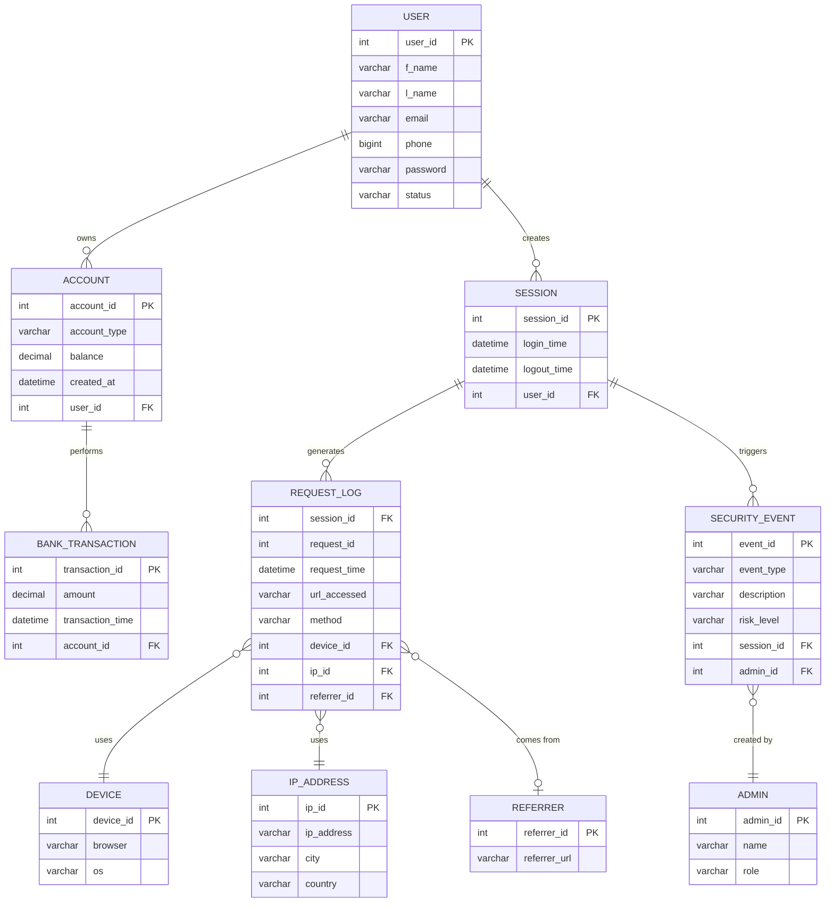

# 🏦 Banking Security System
### 21CSC205P - Database Management Systems | Mini Project

> A structured relational database solution for managing banking operations alongside advanced security monitoring and activity tracking.

---

## 👥 Team

| Name | Roll Number |
|------|-------------|
| Aryan Singh | RA2411030010159 |
| Harmandeep Singh | RA2411030010150 |

**Guide:** Dr. G. Parimala, Assistant Professor, NWC  
**Department:** Networking and Communications, School of Computing  
**Institution:** SRM Institute of Science and Technology, Kattankulathur – 603 203

---

## 📌 About the Project

Modern banking platforms need to do more than just store account and transaction data - they need to track *who* accessed the system, *from where*, *on what device*, and *when*, so that suspicious behaviour can be detected and investigated.

This project designs a complete relational database that integrates:
- Core banking (users, accounts, transactions)
- Session and activity tracking (logins, HTTP request logs, devices, IP addresses)
- Security monitoring (security events reviewed by admins)

The database is designed using the **Entity–Relationship (ER) model**, mapped to a relational schema, and implemented in **MySQL**.

---

## 🗂️ Repository Structure

```
BankingSecuritySystem/
│
├── BankingSecuritySystem_FULL.sql       ← Run this first - creates DB, all tables, inserts data, and runs all queries
├── BankingSecuritySystem_ViewAll.sql    ← Run after FULL - DESC + SELECT * for every table
└── README.md                            ← You are here
```

---

## 🗃️ Database Schema

The database consists of **10 tables**:

| # | Table | Description |
|---|-------|-------------|
| 1 | `USER` | Registered banking customers |
| 2 | `ACCOUNT` | Bank accounts owned by users |
| 3 | `SESSION` | User login sessions |
| 4 | `BANK_TRANSACTION` | Financial transactions on accounts |
| 5 | `DEVICE` | Browser and OS used during access |
| 6 | `IP_ADDRESS` | IP address with city and country |
| 7 | `REFERRER` | External sources directing users to the portal |
| 8 | `REQUEST_LOG` | Every HTTP request made during a session *(weak entity)* |
| 9 | `SECURITY_EVENT` | Security alerts triggered by suspicious activity |
| 10 | `ADMIN` | Administrators managing security events |

## 🗺️ ER Diagram



---

## 🚀 How to Run

### Prerequisites
- MySQL 8.0+ installed
- MySQL command line or a client like **MySQL Workbench** / **DBeaver**

### Step 1 - Set up the full database
```bash
mysql -u root -p < BankingSecuritySystem_FULL.sql
```
This will:
- Create the `BankingSecuritySystem` database
- Create all 10 tables in the correct dependency order
- Insert sample data into every table
- Run all queries (constraints, aggregates, joins, views, procedures, functions, triggers, cursors)

### Step 2 - View all tables and their data
```bash
mysql -u root -p < BankingSecuritySystem_ViewAll.sql
```
Or if you're already inside the MySQL shell:
```sql
SOURCE BankingSecuritySystem_FULL.sql;
SOURCE BankingSecuritySystem_ViewAll.sql;
```

---

## 📋 Queries Covered

| Section | Topics |
|---------|--------|
| DDL | `CREATE DATABASE`, `CREATE TABLE` with all constraints |
| DML | `INSERT INTO` for all 10 tables |
| Constraints | `CHECK`, `UNIQUE` via `ALTER TABLE` |
| Aggregates | `SUM`, `AVG`, `MAX` |
| Set Operations | `UNION`, `INTERSECT`, `NOT IN` |
| Subqueries | Nested `SELECT` with `WHERE` conditions |
| Joins | `INNER JOIN` across multiple tables |
| Views | `CREATE VIEW` for reusable query results |
| Stored Procedures | `CREATE PROCEDURE` with exception handling |
| Functions | `CREATE FUNCTION` with `DETERMINISTIC` flag |
| Triggers | `BEFORE INSERT` triggers with `SIGNAL SQLSTATE` |
| Cursors | Row-by-row iteration with `FETCH` loop |

---

## 🔑 Key Design Decisions

- **`BANK_TRANSACTION`** instead of `TRANSACTION` - `TRANSACTION` is a reserved SQL keyword and would cause syntax errors
- **`REQUEST_LOG`** uses a composite primary key `(session_id, request_id)` - it is a weak entity whose existence depends on `SESSION`
- **`referrer_id`** in `REQUEST_LOG` is nullable - direct traffic (no referrer) is a valid case
- Tables are created in **dependency order** - independent tables first, then those with foreign keys - so no FK references a non-existent table
- All foreign keys use **named constraints** (e.g. `fk_account_user`) for easier debugging

---

## 🌐 Why This Project Isn't Hosted

This is a database-only project - there is no backend or frontend. The database runs locally on MySQL, which means it can't be exposed to the internet directly.
To host this properly would require migrating the database to a cloud provider (e.g. PlanetScale, Railway, or Aiven) and building an API layer on top - which is outside the scope of this DBMS mini project.
If you want to explore the project, clone the repo and run it locally using the instructions above - it takes under a minute to get everything up and running.

---

## 🛠️ Tech Stack

| Tool | Purpose |
|------|---------|
| MySQL 8.0 | Database engine |
| Draw.io | ER diagram design |
| SQL | Query language |
| HTML | Front-end design |
| GitHub | Version control |

---

*SRM Institute of Science and Technology - May 2026*
